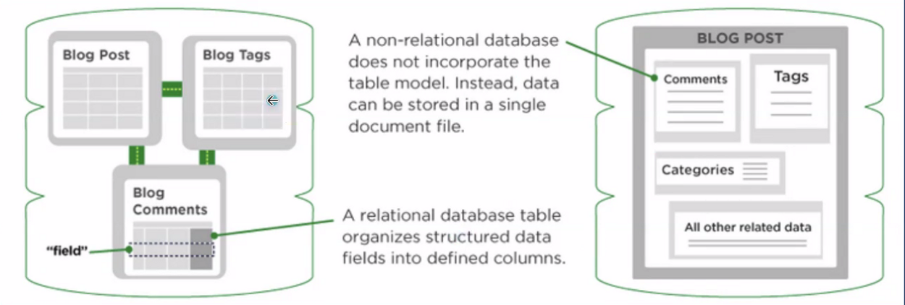
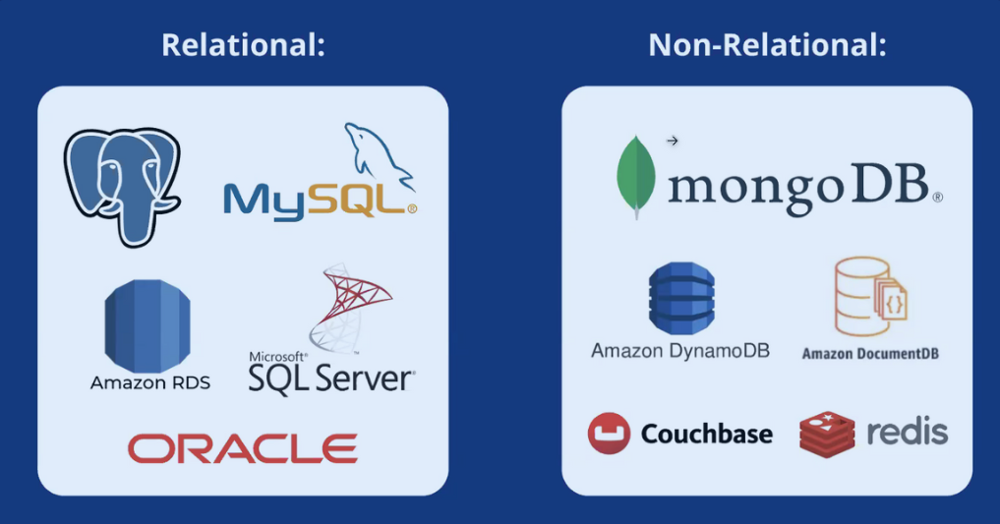
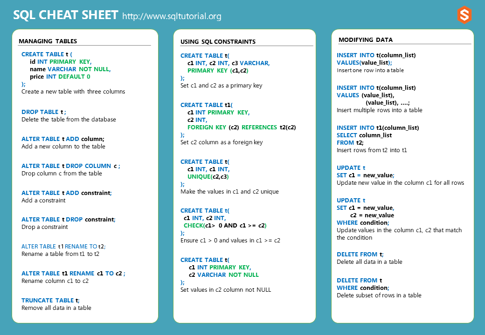
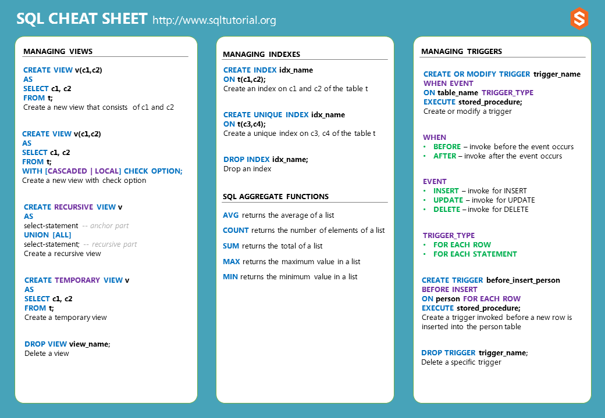

✅ New Team: Peter and Ilwad

✅ Introduction to SQL

- SQL stands for Structured Query Language
- is a standard language for accessing and manipulating databases

✅ Learned the difference between Relational and Non-relational databases

✅ Practiced SQL CRUD operations on db-fiddle.com

