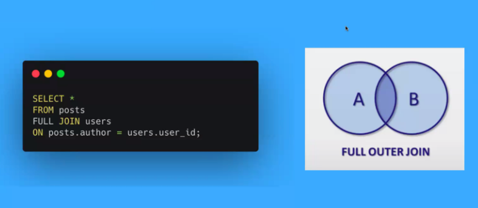

✅ SQL Joins

- a JOIN clause is used to combine rows from two or more tables, based on a related column between them.

- is much quicker and more efficient than doing two separate queries

  - (INNER) JOIN: returns records that have matching values in both tables

  

  - LEFT (OUTER) JOIN: returns all records from the left table, and the matched records from the right table

  

  - RIGHT (OUTER) JOIN: returns all records from the right table, and the matched records from the left table

  

  - FULL (OUTER) JOIN: returns all records when there is a match in either left or right table

  

✅ ERD = Entity Relationship Diagram

  

- ERD is a type of flowchart that illustrates how “entities” such as people, objects or concepts relate to each other within a system.
