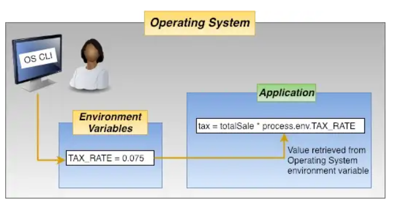

✅ Created a database with @ElephantSQL

✅ Saved our sensitive data into an environment variable using DotEnv

- Dotenv is a zero-dependency module that loads environment variables from a .env file into process.env.

- is a great way to keep passwords, API keys, and other sensitive data out of your code. It allows you to create environment variables in a .env file instead of putting them in your code.

- environment variables are often used to store the name of the environment in which the app is currently running.

✅ Learned about node-Postgres connection pooling

- whenever a user sends a request, the backend database or servers need to perform several activities to open a connection, maintain it, and close it. Several resources are used to perform these functions.

- connection pooling is the process of having a pool of active connections on the backend servers

- these can be used any time a user sends a request

- instead of opening, maintaining, and closing a connection when a user sends a request, the server will assign an active connection to the user

- once the user has completed their process, the active connection will be added back to the pool of connections

- this way, the number of overhead operations drops significantly, optimizing the servers' performance and solving the problem of low transaction frequency and high latency

✅ Used node-Postgres to connect and query the PostgreSQL database
