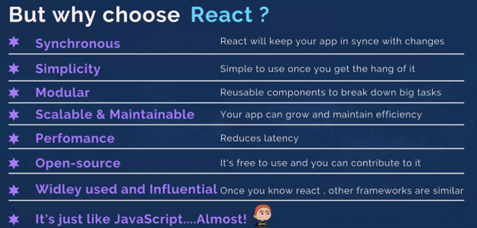

New Pair: Francesca

✅ What is React?

- a JavaScript library for building user interfaces

✅ First we created react elements using React.createElement

- React components implement a render() method that takes input data and returns what to display. This example uses an XML-like syntax called JSX. Input data that is passed into the component can be accessed by render() via props.

- React works by creating JSX files where we’ve got HTML right in the body of a JS file

- behind the scenes our HTML is picked up by a compiler and it gets converted (compiled) down to actual JS. The compiler comes from importing the react package on the first line

✅ Then we added Babel to our scripts, which allowed us to write JSX

- JSX is a syntax extension for JavaScript. It was originally developed for use with the React library, but has since been adopted by other libraries as well.

- JSX allows you to write HTML-like code in your JavaScript files. When your code is compiled, the JSX is transformed into regular JavaScript code. This can make your code easier to read and understand, especially if you are building a complex user interface.

✅ Later learned how to use props

- "props" are short for "properties." They are a way of passing data from a parent component to a child component

- props are essentially variables that you can pass to a component when you render it
