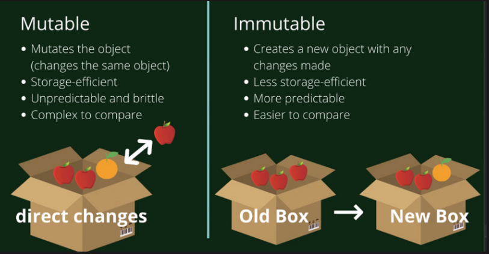

✅ mutable array methods

<b>Adding items</b>

- push: add an item to the end of an array

- unshift: add an item to the beginning of an array

<b>Removing items</b>

- pop: remove an item at the end of an array; can pass no arguments

- shift: removes an item at the beginning of an array

<b>Changing items</b>

- fill: overwriting existing items in the array. It can have up to three arguments; the first argument is used for a new value, second for startIndex (optional), and third for endIndex (also optional).

<b>Re-order items</b>

- reverse: reverse the order of the array

- sort: sorts array in some different order. We need to specify two parameters because it will compare the values of the first and the second item. It can be used to sort an array in many ways

array.sort((name1, name2) => name1 < name2);

✅ immutable array methods

- spread operator: allows us to quickly copy all or part of an existing array or object into another array or object

- the spread operator is often used in combination with destructuring

The spread operator is a quick syntax for :

1. Copying an array
2. Adding items to arrays
3. Combining arrays or objects
4. Spreading an array out into a function’s argument
5. Combining objects
6. Adding to state in React
7. Converting NodeList to an array

<b>Adding, removing or changing items</b>

- splice: can be used to remove, change, or add items. The first argument is the startIndex, the second argument is the deleteCount, and the arguments after are the items.

✅ react.components and how to use props
