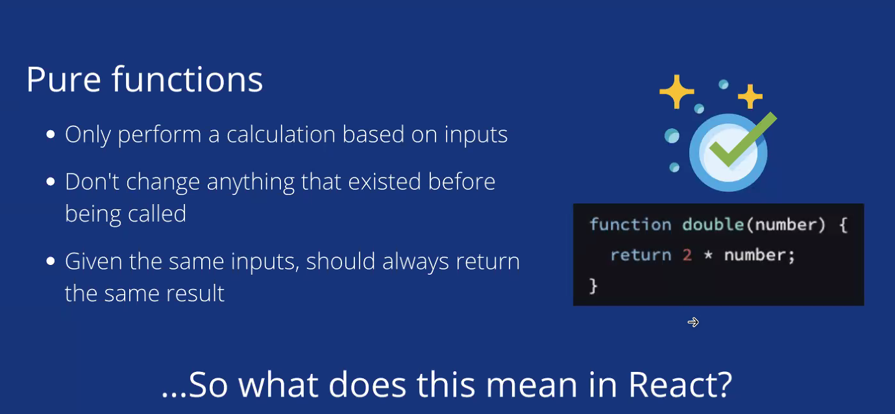
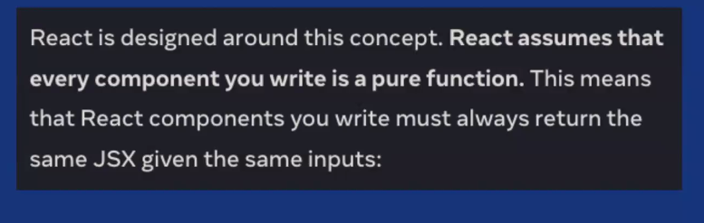
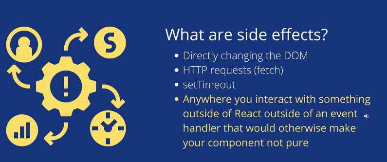
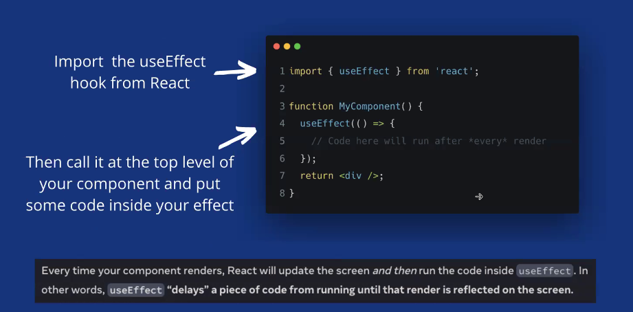
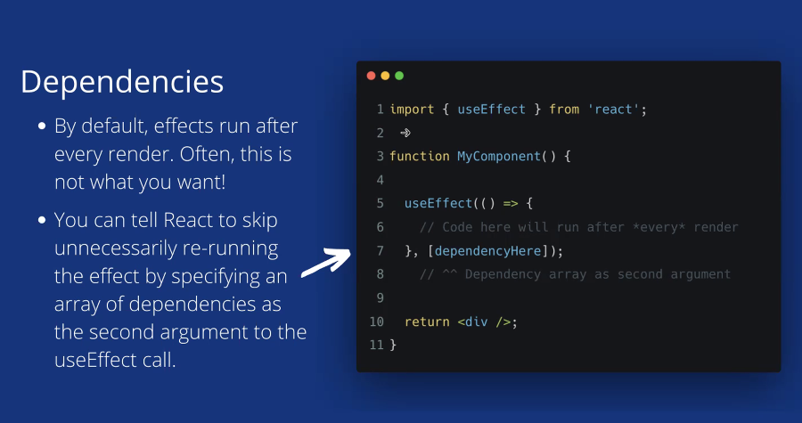
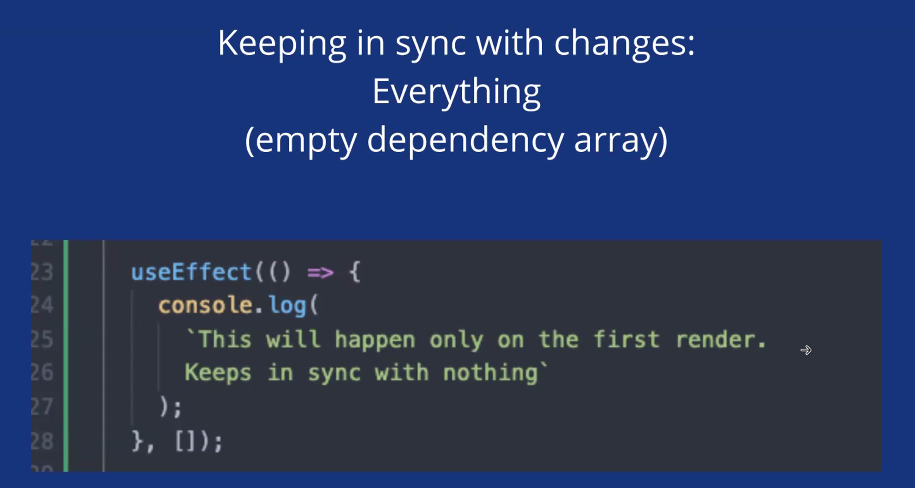
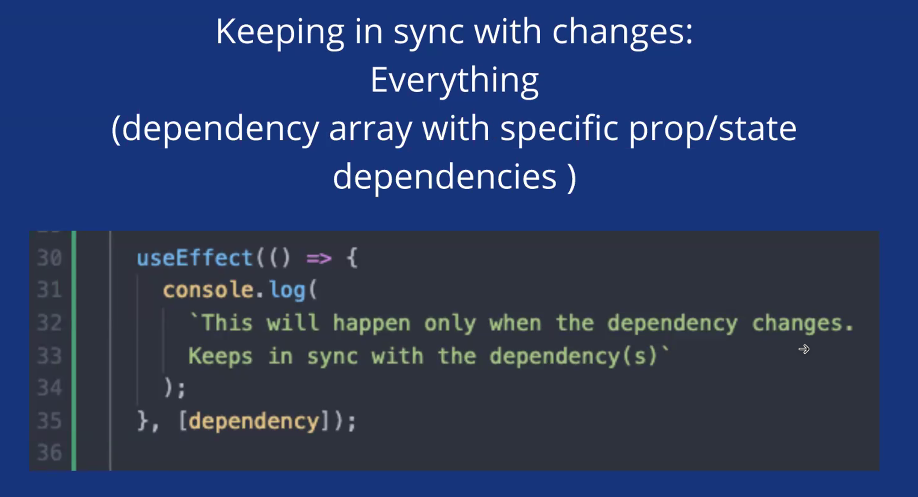

New pair: Robin 🦖

✅ started the day with a great recap of RESTful APIs given by Nadeem and Camille - Talis

<b>What is REST?</b> REpresentational State Transfer

- an architectural style centred around resources, based on web standards and the HTTP Protocol

- separation of concerns → clients and servers are two separate

- stateless - there is no client content in the request → the server doesn't keep track of the users’ request

- cacheable → make a request to a server → server gives back the response → the website is loaded → you closed the website and open it after a minute → it loads quickly = saved into cache ⇒ have seen the request before and the response hasn’t changed

  <b>What are resources?</b>

- fundamental building blocks of web-based systems
- might be a collection of objects or an individual object
- is identified by URI
- is manipulated through CRUD

  <b>What is a REST API endpoint?</b>

- is defined by a combination of a resource URI and an HTTP verb that manipulates it

- URI has to be a plural noun

- GET requests are only for READING!!! ⇒ GET never changes state

✅ learned the importance of keeping react components pure

- it helps to ensure that the component's behavior is predictable and easy to understand

  - allows to better understand how data flows through the application

- pure components only depend on their props and state, so if the same props are passed in, the component will always render the same output
  - this makes it easier to test and debug
  - allows better performance by avoiding unnecessary re-renders

✅ <b>useEffect hook</b> 🪝

- allows you to synchronize a component with an external system or some other logic

- it allows to run side effects, such as data fetching, in functional components.

- this can be useful for performing actions such as fetching data from an API, updating the document title, or manually changing the DOM in response to a user's actions

- takes two arguments: a callback function that contains the side effect logic and a dependency array that tells React when to run the effect

  - the callback function will run after the component has rendered and is also run whenever any of the dependencies in the dependency array change.

- side effects are actions that have an effect on something outside of the component

- "mounting" refers to the process of rendering a component into the DOM for the first time. When a component mounts, it is added to the DOM and becomes visible to the user

