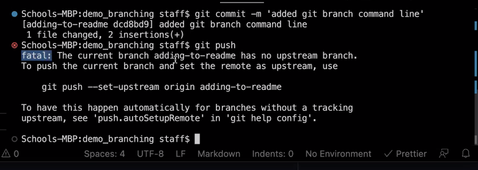
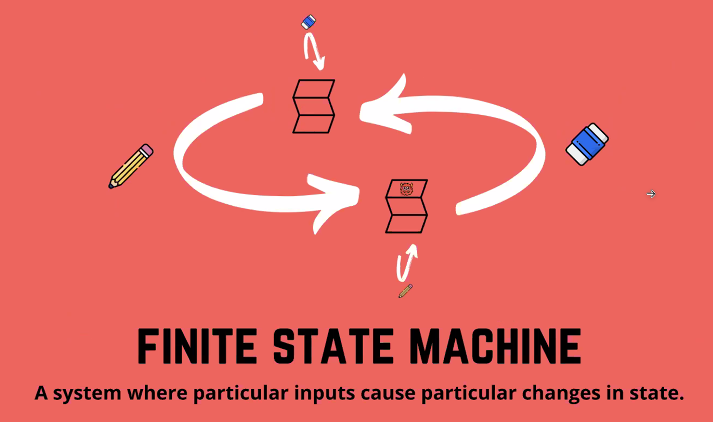
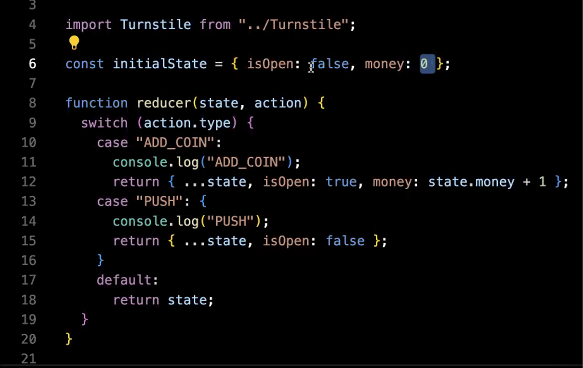
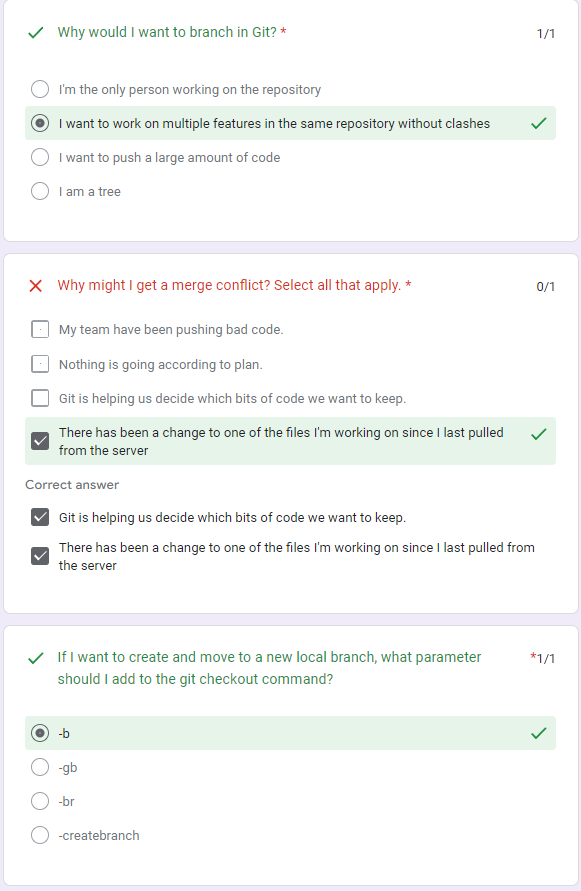
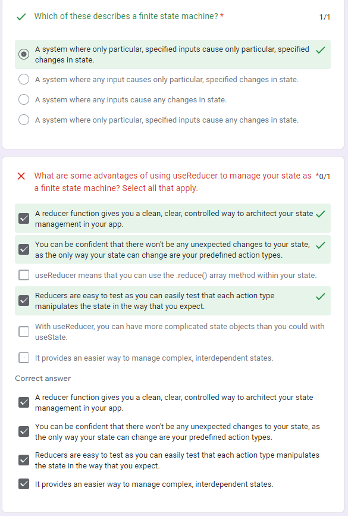
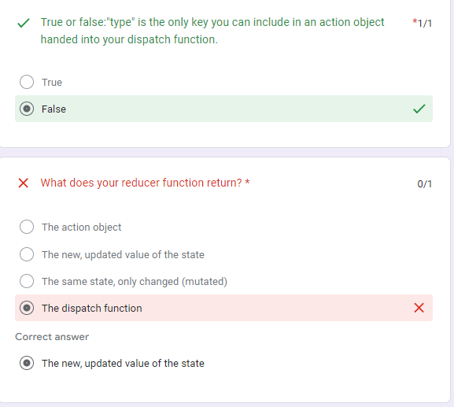

✅ Git Flow

🔸How to find what branches are in a repository?

- git branch

🔸Create a new branch and move to it at the same time

- git checkout -b name

Your branch is a safe place to make changes. If you make a mistake, you can revert your changes or push additional changes to fix the mistake. Your changes will not end up on the default branch until you merge your branch.

-add, commit and push as per usual after the change is done

🔸When we get this error → just read the error and use the recommended command

! the branch just created is only in our repository, but not in the original repository from gitHub

<a href="https://docs.github.com/en/get-started/quickstart/github-flow">Git Flow</a>

✅ Finite State Machine

- everything that happens is under control and expected → can only delete or create

✅ <b>useReducer Hook</b> 🪝

- separates the logic which changes a state from the component which uses it

- ensure our state can only be changed in an explicit number of ways → we can restrict our state

- reduces bugs and makes your code human readable, maintainable(update, delete), and testable

- takes two arguments: the reducer function and the initial state. It returns an array containing the current state and a dispatch function

  - the dispatch function can be called with an action object, which will be passed to the reducer function along with the current state to determine the next state.

- is particularly useful when the state updates are more complex and involve multiple sub-states, and when the state updates are closely related. It also allows for better code organization, and it can be used to implement a finite state machine pattern.

