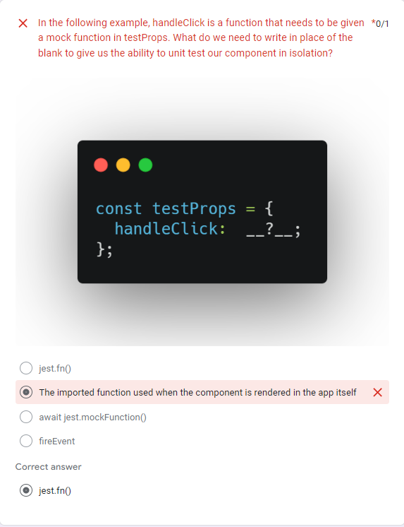

✅ had a great recap of UNIT TESTING with Arshi

- Why testing is good? What are the benefits of testing?

  - gives you confidence that your code is doing what is expected to do

  - predict how user is going to use the app

  - if we do the testing early prevents

  - catch bugs, early feedback → makes the refactoring easier

  - their are automated (run them in the cloud, locally, run them as often and when you need them)

- What are some disadvantages of testing?

  - might affect your creativity

  - it is time consuming → take time and resource

  - if the test are not written well can affect the confidence

✅ continued with React testing library and how to use different types of queries

- What is create react app?

  - it will install a bunch of config web for us

  - we get a dev setup → npm: start ⇒ when we make change to the files it will automatically update the browser

  - it will running JEST for us behind the scene → we don’t have to install it or create our test script

  - npm t will invoke the test script to run ( npm t-- name file → will run the test only from that file)

<b>What is React testing library?</b>

- is a very light-weight solution for testing React components

- a way to test your react code → render, evaluate and make sure that the right things are showing up

- gives us the stuff to work with DOM node specifically

- works with Jest in doesn’t replace it

<b>What are the pros/cons of using it?</b>

- makes loading state really easy
- you test what the user sees rather than just the backend

- we just work with DOM node → we test what’s changing in the DOM

<b>TEST AN INPUT</b>

- in the form.js

- whatever you're passing down for that handleNewName, you want to be able to refer to it later → using a prop object → which

- in the form.test.js

- we can also write it like this

<b>TEST A BUTTON</b>

→ we could have used toHaveBeenCalled() only if we don’t want to be that strict

→ we need to click the button first for that function handleNewName to happen
