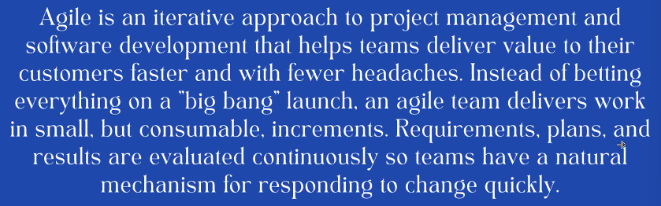
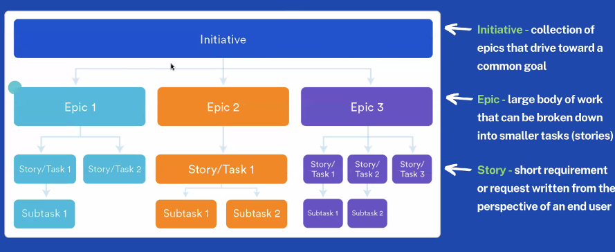
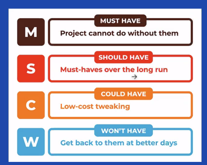
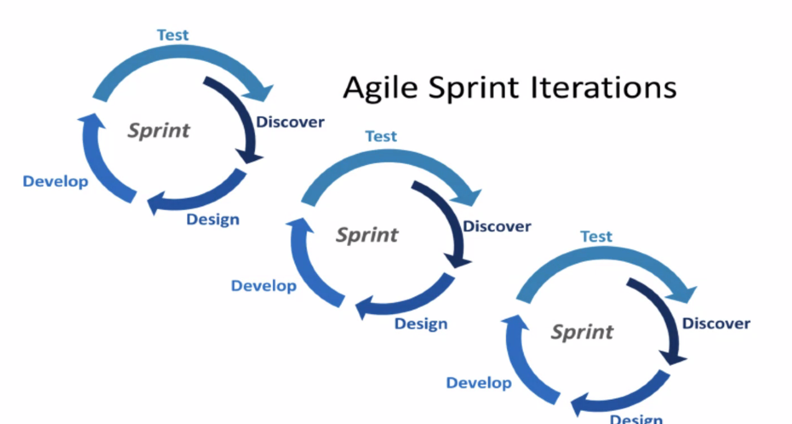

✅ mindset session on team manifesto

- a typical team manifesto includes the following elements:

  - Mission statement: A clear and concise statement that defines the team's purpose and goals

  - Values: A set of core principles that the team believes in and will guide their behavior

  - Behaviors: A set of guidelines for how team members should interact and communicate with one another

  - Decision-making: A process for how the team will make decisions, and who has the authority to make them

  - Meeting guidelines: A set of rules for how team meetings will be conducted, including attendance, agenda, and participation.

  - Conflict resolution: A process for how the team will handle conflicts that may arise

✅ Agile recap

✅ team research and presentation task about Standups and Retros

Have two meetings per day

- morning meeting: STAND UPS

  - what do we want to achieve on that day?

  - what are the strategies to accomplish the tasks?

- end of day meeting: RETRO

  - what tasks did we complete?

  - what is everyone’s progress?
