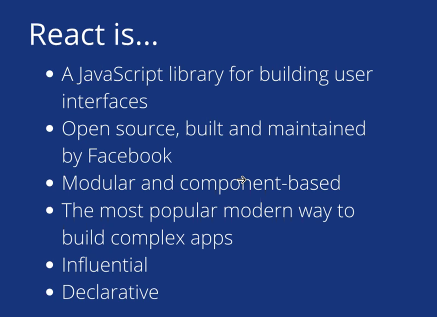
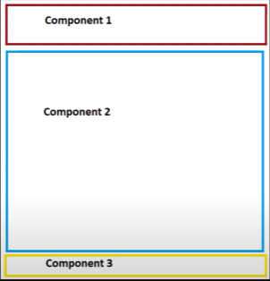

✅ REACT RECAP

**What is React?**

**What are components in Single Page Application?**

- every page can be broken down into a certain amount of components: header, content, footer

**_!!!_** → when you are not using a single-page application → when you want to change something that is displayed in any one of these 3 components → the whole webpage will reload and all of the components will reload

⇒ takes up a lot of time and processing power on the browser

**_!!!!!_** → but with a single-page app → for example if you go on a page and the only thing that is going to be different on that page is the content within it and the other components will remain the same (header, footer)

→ then only the HTML within that content area will be changing

**What is create react app?** - is an npx tool → which is a subsection of node and npm → and allows

    us to install react app without worrying about the plumbing that goes behind the scene

    → npx is a tool for npm that allows us to bulk-install applications

    `npx react-app my-app`

**Node_modules:** contains a bunch of dependencies needed to build up the react app

    → this file it is ignored → in the .gitignore file because it is a huge file and if you push this to GitHub and somebody pulls down your code → he will do `npm i` to install all de dependencies the app relies on

**Package,json** is a really important file that contains:

    → the name of our app

    → the version of our app

    → **dependencies**: are really important because without them the application won’t work

    → **scripts**: tells you all the sorts of scripts you can run from npm (npm start, npm test, npm build)

**Package-lock,json**

    → is a list of all your dependencies with all sorts of sub-dependencies and the exact versions

**What is JSX?** - it is plain HTML but we also have embedded javascript inside of it - the structure of the code when it comes to JSX will be the same

**How can we structure the components of a react app?** 1. class-based methodology 2. functional based methodology

Dynamic change = when we make a change will automatically rerender everything - this is a nice _feature_ of react

Index.js - the root - is what calls our top-level component - components should start with an upper case letter → that’s the convention

When you render something in react, especially when it comes in a return from a component, it has to have only one top-level component

    ⇒ in HTML we usually don’t want to arbitrarily wrap content in divs, so the way to get around that is by wrapping them into a `<React.Fragment></React.Fragment>` = is a substitute parent component that has no default style (acts like a div)

    → we don’t want to use div because it has a default styling of display: block → will create a problem if want to use the flex-box

    ⇒ keeps the react app clean of unnecessary styling

    1. When it comes to react there are only certain actions that are performed in a component that will cause the UI to dynamically update

    ⇒ one way to control those changes in react is called **Hooks** = a function that sort of gets triggered and when it gets triggered it somehow affects either a variable or the state of our application

What is a props? - is a variable you pass from a parent component to a child component

    - if you console log props → it is going to be an object
