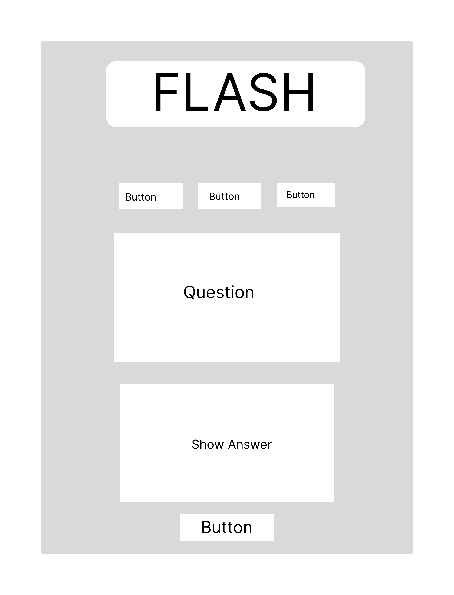
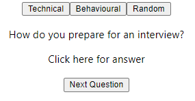
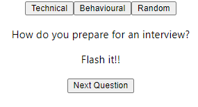

✅ created the low and high fidelity wireframes

✅ split into two teams: frontend/backend

- decided to build the frontend with Jason

✅ initialized a new react app

- npx create-react-app

✅ created 3 different components

- NavBar that contains the logo and buttons for different type of questions (technic, behavioural and random)

- Cards

- Card: answerCard and questionCard

✅ learned how to pass children as props

- cards component has answerCard and questionCard as child 

✅ MPV almost done

- MVP (short for "Minimum Viable Product") is a development approach that involves creating a basic version of a product with just enough features to satisfy early customers and gather valuable feedback for further development