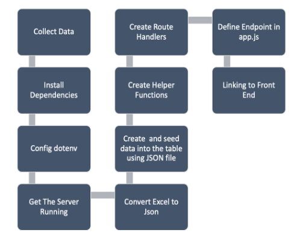

✅ had a difficult but helpful conversation with members of the team and decided to go over the code once more instead of working on our stretch goals

- this open conversation helped the team move in the right direction

✅ we started from scratch to better understand the app functionality works

✅ this time we broke down each task

✅ we’ve done some backend and frontend testing

- unit testing: Jest
- integration testing: Supertest

✅ worked on PP presentation
